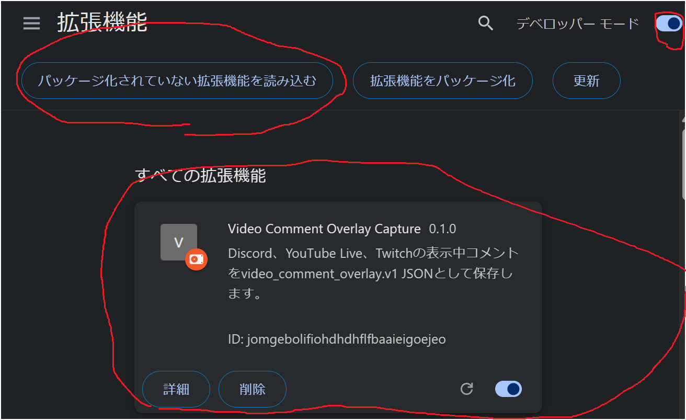
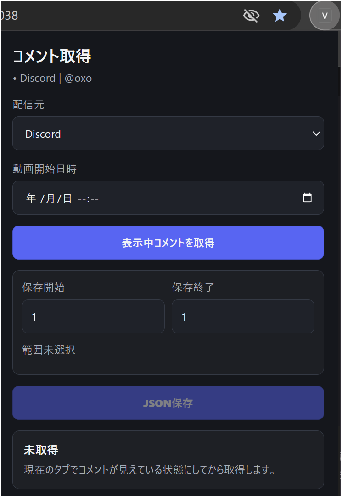

# Chrome拡張の入れ方

この手順は、Discord / YouTube Live / Twitchの画面に見えているコメントをJSON保存するためのChrome拡張を入れる方法です。

## 先に知っておくこと

- この拡張はChromeウェブストアから入れる通常の拡張ではありません。
- ZIPを展開したフォルダを、Chromeの「デベロッパーモード」から読み込みます。
- Chromeに読み込ませるのはZIPファイルではなく、展開済みフォルダです。
- 取得できるのは、表示中またはページDOMに存在するコメントだけです。
- cookie、token、browser profile、localStorage、sessionStorageは読みません。
- 取得結果はローカルのJSONとして保存します。外部サーバーへ送信しません。

## 使うフォルダ

配布ZIPを展開した場合は、次のフォルダを使います。

```text
extensions/chrome-capture/
```

repoから直接使う場合も、同じ `extensions/chrome-capture/` を選びます。

## インストール手順

1. Chromeで `chrome://extensions` を開きます。
2. 右上の `デベロッパーモード` をONにします。
3. `パッケージ化されていない拡張機能を読み込む` を押します。
4. `extensions/chrome-capture/` フォルダを選びます。
5. `Video Comment Overlay Capture` が一覧に出れば読み込み完了です。



## コメントを取得する手順

1. ChromeでDiscord / YouTube Live / Twitchの対象ページを開きます。
2. コメントが画面に見えている状態にします。
3. Chrome右上の拡張アイコンから `Video Comment Overlay Capture` を開きます。
4. `配信元` を選びます。迷ったら対象サービス名を手で選びます。
5. 必要なら `動画開始日時` を入れます。
6. Discordの場合は、必要に応じて `Live開始` または `過去へ1ステップ` を使います。
7. `表示中コメントを取得` を押します。
8. 取得件数、先頭/末尾の時刻、プレビューを確認します。
9. 保存したい範囲だけ `保存開始` / `保存終了` に入れます。
10. `JSON保存` を押します。
11. viewer本体の `ファイル取込` から保存したJSONを読み込みます。



## よくあるつまずき

| 状況 | 対応 |
|---|---|
| ZIPを選んでも読み込めない | ZIPを展開し、展開後のフォルダを選びます |
| `デベロッパーモード` が見つからない | `chrome://extensions` 画面の右上を確認します |
| 取得件数が0件 | コメントが画面に見える状態にしてから再取得します |
| 余計な古いコメントが入る | プレビューで保存範囲を狭めてからJSON保存します |
| 動画開始より前のコメントがある | viewer側で動画開始日時を指定して読み込むか、拡張側の保存範囲で除外します |
| YouTube / Twitchで時刻が取れない | 表示順の相対タイムラインとして保存されることがあります |

## Discordで長めに取る場合

Discordは画面外の全履歴を一度にDOMへ持たないため、完全履歴取得は保証しません。Bot/APIが使えない場合は、次の流れが安定します。

1. 対象スレッドを開き、コメントが見える状態にします。
2. `Live開始` を押します。
3. これから流れるコメントは、DOM変化として蓄積されます。
4. 過去分が必要な場合は `過去へ1ステップ` を押します。
5. 件数と先頭/末尾時刻を見ながら、必要範囲まで繰り返します。
6. `表示中コメントを取得` でプレビューへ反映します。
7. 保存範囲を選び、`JSON保存` を押します。

保存JSONには、取得範囲が部分的であること、直近のスキャン状態、停止理由がmanifestに入ります。

## スクショと動画を足すなら

後から説明用素材を足す場合は、この置き場に入れます。

```text
docs/assets/extension-install/
```

現在入っているスクショ:

- `01-chrome-extensions.png`: `chrome://extensions` を開いた画面
- `05-popup-preview.png`: 取得前のポップアップと保存範囲

追加するとさらに分かりやすいスクショ:

- `02-developer-mode.png`: デベロッパーモードをONにする位置
- `03-load-unpacked.png`: `パッケージ化されていない拡張機能を読み込む` ボタン
- `04-select-folder.png`: `extensions/chrome-capture/` フォルダ選択
- `06-import-json.png`: viewer本体へJSONを読み込む画面

短い動画を作るなら、30〜60秒で次の流れだけを撮ると十分です。

1. `chrome://extensions` を開く。
2. デベロッパーモードをON。
3. `extensions/chrome-capture/` を読み込む。
4. 対象ページでコメントを取得。
5. プレビューで範囲を選ぶ。
6. JSON保存。
7. viewerに読み込む。
